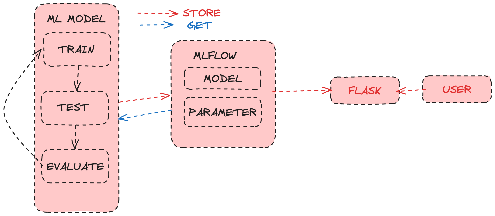

# ml-regression-flask

## Steps by step for running locally
1. Install dependencies using `pip install -r requirements.txt`
2. Run `python3 models/regression.py` to run and test the model
3. Run `python3 server/regression.py` to run endpoint server reggresion

# Run with docker
1. `docker build -t regression-flask:latest .`
2. `docker-compose up --build -d`
# Run in docker container
3. `docker exec -it regression-flask bash`
4. `cd models`
4. `python3 regression.py`
# Run in local
3. Export environment variables in terminal session
```
export AWS_ACCESS_KEY_ID=minio
export AWS_SECRET_ACCESS_KEY=minio123
export MLFLOW_S3_ENDPOINT_URL=http://localhost:9000
```
5. Open `models/regression.py`
6. Change `mlflow.set_tracking_uri("http://web:5000")` to `mlflow.set_tracking_uri("http://localhost:5000")`
7. Change `dataset = pd.read_csv('/app/data/salary.csv')` to `dataset = pd.read_csv('data/salary.csv')`
8. `python3 models/regression.py`
9. Get run id from MLFlow UI
10. Open browser and go to `http://localhost:5002?exp={experience}&run_id={run_id}`



